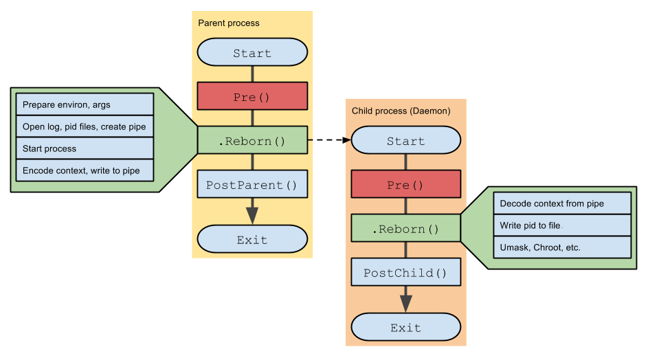

# Daemon en Go — PR2 SO1 | 201905884

## Descripcion General

El daemon es un proceso en espacio de usuario escrito en Go que lee periodicamente los archivos virtuales expuestos por el modulo del kernel en `/proc`, los parsea y persiste los datos en archivos JSON Lines.

Fuentes que consume:

- `/proc/meminfo_pr2_so1_201905884` → estadisticas de RAM
- `/proc/continfo_pr2_so1_201905884` → procesos Docker y contenedores

Salidas que produce:

- `/tmp/meminfo.jsonl` → una linea JSON por lectura de memoria
- `/tmp/continfo.jsonl` → una linea JSON por lectura de contenedores

## Arquitectura por Capas

El daemon sigue un diseño de capas donde cada paquete tiene una unica responsabilidad. Ningun paquete conoce los detalles internos de otro.



```text
┌─────────────────────────────────────────────────────────────────┐
│                        KERNEL SPACE                             │
│  /proc/meminfo_pr2_so1_201905884   → RAM_TOTAL_MB, FREE, USED  │
│  /proc/continfo_pr2_so1_201905884  → PID, VSZ, RSS, MEM, CPU   │
└──────────────┬──────────────────────────────┬───────────────────┘
               │ insmod (al inicio)            │ polling cada 5s
┌──────────────▼──────────────────────────────▼───────────────────┐
│                        USER SPACE (Go)                          │
│                                                                 │
│  kernel.Load()              → carga el .ko via script bash     │
│          ↓                                                      │
│  source.FileReader.Read()   → []byte (texto crudo)             │
│          ↓                                                      │
│  parser.ParseMemInfo()      → model.MemStats                   │
│  parser.ParseContInfo()     → model.ContainerReport            │
│          ↓                                                      │
│  sink.JSONLineFile.Write()  → /tmp/meminfo.jsonl               │
│                               /tmp/continfo.jsonl              │
└─────────────────────────────────────────────────────────────────┘
```

## Estructura del Proyecto

```text
201905884_LAB_SO1_1S2026_PT2/
├── scripts/
│   └── load_kernel_module.sh          # compila e instala el .ko; verifica /proc
├── Kernel/
│   ├── pr2_so1_201905884.c
│   └── Makefile
└── Daemon/
    ├── cmd/
    │   └── daemon/
    │       └── main.go                # entrada: flags + kernel.Load + senales OS
    ├── internal/
    │   ├── kernel/
    │   │   └── loader.go              # ejecuta el script bash desde Go
    │   ├── app/
    │   │   └── service.go             # orquestador: ticker + leer/parsear/escribir
    │   ├── model/
    │   │   └── metrics.go             # structs de dominio: MemStats, ContainerReport
    │   ├── parser/
    │   │   ├── meminfo.go             # texto crudo → MemStats
    │   │   └── continfo.go            # texto crudo → ContainerReport
    │   ├── sink/
    │   │   └── jsonfile.go            # struct → JSON Lines en archivo
    │   └── source/
    │       └── file_reader.go         # lee /proc con cancelacion por contexto
    ├── doc/
    │   └── Daemon.md
    ├── go.mod
    └── go.sum
```

**Regla de capas:** `app/service.go` no sabe como se lee ni como se parsea. Solo orquesta quien llama a quien y cada cuanto tiempo.

## Componentes

### 1. kernel — Carga del modulo

Antes de que el daemon pueda leer `/proc`, el modulo de kernel debe estar insertado en el kernel en ejecucion. El paquete `kernel` encapsula esta responsabilidad.

**Archivos involucrados:**

- `scripts/load_kernel_module.sh` — script bash que realiza el trabajo real
- `Daemon/internal/kernel/loader.go` — paquete Go que invoca el script

#### scripts/load_kernel_module.sh

El script tiene cinco responsabilidades en orden:

| Paso | Comando | Que hace |
|---|---|---|
| 1 | `lsmod \| grep` | Si el modulo ya esta cargado, sale con exit 0 (idempotente) |
| 2 | `[ ! -f .ko ]` + `make` | Compila el `.ko` solo si no existe todavia |
| 3 | `insmod .ko [container_id=...]` | Inserta el modulo en el kernel; pasa el parametro opcional |
| 4 | `[ -r /proc/... ]` | Verifica que ambas entradas `/proc` quedaron disponibles |
| 5 | `echo OK` | Confirma exito; el daemon recibe esta linea en su log |

Acepta un argumento opcional: el ID del contenedor Docker que el modulo usara para filtrar procesos via cgroup v2.

```bash
# Sin filtro de contenedor
sudo ./scripts/load_kernel_module.sh

# Con container ID
sudo ./scripts/load_kernel_module.sh abc123def456
```

**Por que `set -euo pipefail`:**

| Flag | Efecto |
|---|---|
| `-e` | Aborta si cualquier comando retorna codigo != 0 |
| `-u` | Aborta si se usa una variable no definida |
| `-o pipefail` | Propaga errores a traves de pipes (`cmd1 \| cmd2` falla si `cmd1` falla) |

**Por que `BASH_SOURCE[0]` para calcular rutas:**
Permite obtener la ruta absoluta del script sin importar desde que directorio se lo llame. `dirname` extrae la carpeta y `cd + pwd` la convierte en absoluta.

#### Daemon/internal/kernel/loader.go

```go
type LoadOpts struct {
    ScriptPath  string
    ContainerID string
}

func Load(opts LoadOpts) error
```

**Flujo de `Load()`:**

1. `os.Stat(opts.ScriptPath)` — verifica que el script existe antes de ejecutar; da un error claro si no.
2. Construye `args := []string{ScriptPath}` y agrega `ContainerID` si no esta vacio.
3. `exec.Command("/bin/bash", args...)` — invoca bash explicitamente, no depende del shebang.
4. `CombinedOutput()` — ejecuta el script y captura stdout + stderr en un unico buffer; espera a que termine.
5. Loguea cada linea de salida del script en el log del daemon.
6. Si el script retorno codigo != 0, retorna `fmt.Errorf("kernel: script fallo: %w", err)`.

**Por que `CombinedOutput()` en vez de `Output()`:**
El script puede escribir errores en stderr (por ejemplo el mensaje de `insmod`). Con `CombinedOutput()` ambos streams llegan al log del daemon en el orden en que fueron escritos.

**Por que `fmt.Errorf` con `%w`:**
El `%w` envuelve el error original (`*exec.ExitError`). El caller puede inspeccionarlo con `errors.Is()` o `errors.As()` sin perder la informacion del error subyacente.

### 2. source — Lectura de archivos

Define la interfaz `Reader` y su implementacion `FileReader`.

```go
type Reader interface {
    Read(ctx context.Context) ([]byte, error)
    Name() string
}

type FileReader struct {
    Path string
}
```

**Flujo de `Read()`:**

1. Verifica si el contexto fue cancelado (`ctx.Done()`). Si el daemon esta apagandose, no lee.
2. Llama a `os.ReadFile(r.Path)` que carga el pseudo-archivo completo en memoria.
3. Envuelve el error con la ruta del archivo para facilitar el diagnostico.

**Por que polling y no inotify:**
Los archivos en `/proc` son virtuales (se generan en cada lectura). Los watchers como `inotify` no detectan cambios en pseudo-archivos del kernel. El polling cada N segundos es el metodo correcto y estable.

Salida esperada al leer `/proc/meminfo_pr2_so1_201905884`:

```text
RAM_TOTAL_MB=7856
RAM_FREE_MB=4120
RAM_USED_MB=3736
```

Salida esperada al leer `/proc/continfo_pr2_so1_201905884`:

```text
container_id=abc123def456
PID    NAME              VSZ_(KB)   RSS_(KB)   %MEM_PCT   %CPU_RAW   CONTAINER_ID
1234   dockerd           102400     51200      1          9876543    -
5678   containerd        204800     102400     2          1234567    abc123def456
CONTAINERS_ACTIVE=1
```

### 3. model — Structs de dominio

Define las estructuras que representan los datos del sistema.

```go
type MemStats struct {
    MemTotal  uint64
    MemFree   uint64
    MemUsed   uint64
    Timestamp time.Time
}

type ProcessInfo struct {
    Pid         int
    Name        string
    VSZkb       uint64
    RSSkb       uint64
    MemPct      uint64
    CPURaw      uint64
    ContainerID string
}

type ContainerReport struct {
    FilterID         string
    Processes        []ProcessInfo
    ContainersActive int
    Timestamp        time.Time
}
```

**Por que `uint64` y no `int`:**
El kernel escribe estos valores con el formato `%llu` (unsigned long long). Nunca son negativos. Usar `uint64` refleja exactamente el tipo de origen.

**Por que `Timestamp` en los structs:**
Al serializar a JSON Lines, cada entrada queda marcada con la hora exacta de la lectura. Esto permite correlacionar datos de meminfo y continfo en el tiempo.

### 4. parser — Texto a structs

Convierte los bytes crudos devueltos por `FileReader` en structs tipados.

#### meminfo.go

```go
func ParseMemInfo(raw string) (model.MemStats, error)
```

Algoritmo:

1. Divide el texto en lineas con `strings.Split(raw, "\n")`.
2. Para cada linea usa `strings.SplitN(linea, "=", 2)` — el `2` garantiza maximo 2 partes aunque el valor contenga `=`.
3. Aplica `strings.TrimSpace` a clave y valor.
4. Con un `switch` sobre la clave asigna cada valor usando `strconv.ParseUint`.
5. Valida que `MemTotal != 0` antes de retornar.
6. Asigna `Timestamp = time.Now()`.

#### continfo.go

```go
func ParseContInfo(raw string) (model.ContainerReport, error)
```

El archivo tiene cuatro tipos de lineas distintos que requieren estrategias diferentes:

| Tipo | Ejemplo | Estrategia |
|---|---|---|
| A — metadata inicial | `container_id=abc123` | `HasPrefix` + `TrimPrefix` |
| B — header | `PID\tNAME\tVSZ...` | `HasPrefix("PID\t")` → ignorar |
| C — datos de proceso | `142\tdockerd\t102400...` | `Split("\t")`, 7 campos |
| D — metadata final | `CONTAINERS_ACTIVE=1` | `HasPrefix` + `TrimPrefix` |

**Falla suave (Opcion B):**
Si una linea de proceso tiene formato inesperado (menos de 7 campos, valor no numerico), se salta con `continue`. El daemon no muere por un dato mal formado en un momento de carga del kernel.

```go
parts := strings.Split(line, "\t")
if len(parts) != 7 {
    continue  // opcion B: ignorar linea malformada
}
```

Mapeo de columnas a campos del struct:

| `parts[i]` | Campo | Tipo |
|---|---|---|
| `parts[0]` | `Pid` | `strconv.Atoi` |
| `parts[1]` | `Name` | string directo |
| `parts[2]` | `VSZkb` | `strconv.ParseUint` |
| `parts[3]` | `RSSkb` | `strconv.ParseUint` |
| `parts[4]` | `MemPct` | `strconv.ParseUint` |
| `parts[5]` | `CPURaw` | `strconv.ParseUint` |
| `parts[6]` | `ContainerID` | string directo (puede ser `"-"`) |

### 5. sink — Persistencia de datos

Define la interfaz `Writer` y su implementacion `JSONLineFile`.

```go
type Writer interface {
    Write(v any) error
}

type JSONLineFile struct {
    Path string
}
```

**Flujo de `Write()`:**

1. Abre el archivo con flags `O_CREATE|O_APPEND|O_WRONLY` y permisos `0o644`.
2. `defer f.Close()` garantiza que el archivo se cierra aunque falle el paso siguiente.
3. Serializa el struct a JSON con `json.Marshal(v)`.
4. Escribe los bytes seguidos de `'\n'` al final del archivo.

**Por que JSON Lines y no un array JSON:**

| Aspecto | JSON Lines `.jsonl` | Array JSON `[]` |
|---|---|---|
| Agregar entrada | Solo append al final | Requiere leer y reescribir |
| Leer en tiempo real | `tail -f archivo.jsonl` | No es posible directamente |
| Tolerancia a corrupcion | Cada linea es independiente | Un error rompe todo el archivo |
| Memoria requerida | Constante | Proporcional al tamano total |

### 6. app/service.go — Orquestador

Coordina las capas anteriores sin conocer sus detalles internos.

```go
type Service struct {
    MemReader  source.Reader
    ContReader source.Reader
    MemWriter  sink.Writer
    ContWriter sink.Writer
    Interval   time.Duration
}
```

**Metodo `Run`:**

```go
func (s *Service) Run(ctx context.Context) error {
    ticker := time.NewTicker(s.Interval)
    defer ticker.Stop()

    for {
        select {
        case <-ctx.Done():     // señal de apagado
            return nil
        case <-ticker.C:       // intervalo cumplido
            s.tick(ctx)
        }
    }
}
```

El `select` escucha dos canales simultaneamente. Si llega una senal del OS (via `ctx.Done()`), el daemon sale limpiamente. Si pasa el intervalo, ejecuta un ciclo de lectura.

**Patron de error en cascada en `tick()`:**
Cada paso depende del anterior. Si la lectura falla, no se parsea. Si el parseo falla, no se escribe. En ningun caso el error detiene el daemon, solo se loguea.

```text
Read() ok? → Parse() ok? → Write()
     ↓ error       ↓ error
   log + skip    log + skip
```

### 7. cmd/daemon/main.go — Entrada

Conecta todas las piezas y maneja las senales del OS.

```go
func main() {
    // Flags de linea de comandos
    kernelScript := flag.String("kernel-script", "scripts/load_kernel_module.sh", "...")
    containerID  := flag.String("container-id", "", "...")
    flag.Parse()

    // Cargar el modulo antes de arrancar el daemon
    if err := kernel.Load(kernel.LoadOpts{
        ScriptPath:  *kernelScript,
        ContainerID: *containerID,
    }); err != nil {
        log.Fatalf("main: no se pudo cargar el modulo: %v", err)
    }

    ctx, cancel := context.WithCancel(context.Background())
    defer cancel()

    sigChan := make(chan os.Signal, 1)
    signal.Notify(sigChan, syscall.SIGINT, syscall.SIGTERM)

    go func() {
        sig := <-sigChan
        log.Printf("Received signal: %v, shutting down...", sig)
        cancel()
    }()

    svc := &app.Service{
        MemReader:  source.FileReader{Path: "/proc/meminfo_pr2_so1_201905884"},
        ContReader: source.FileReader{Path: "/proc/continfo_pr2_so1_201905884"},
        MemWriter:  sink.JSONLineFile{Path: "/tmp/meminfo.jsonl"},
        ContWriter: sink.JSONLineFile{Path: "/tmp/continfo.jsonl"},
        Interval:   5 * time.Second,
    }

    log.Println("main: daemon iniciado")
    if err := svc.Run(ctx); err != nil {
        log.Fatalf("main: error fatal: %v", err)
    }
    log.Println("main: daemon detenido")
}
```

**Por que `kernel.Load()` va antes del contexto:**
Si el modulo no carga, las entradas `/proc` no existen y el daemon no tiene fuentes de datos. Fallar rapido con `log.Fatalf` evita que el daemon arranque en un estado invalido.

**Por que `flag.String()` retorna `*string`:**
`flag.String()` retorna un puntero. El `*` en `*kernelScript` lo desreferencia para obtener el valor string. Esto permite que el paquete `flag` modifique la variable internamente al hacer `Parse()`.

**Por que la goroutine para senales:**
`<-sigChan` es una lectura bloqueante. Si estuviera en el hilo principal, el daemon nunca llegaria a `svc.Run()`. La goroutine espera la senal en paralelo mientras el daemon trabaja.

**Senales capturadas:**

| Senal | Origen tipico |
|---|---|
| `SIGTERM` | `kill <pid>`, `systemd stop`, Docker al detener contenedor |
| `SIGINT` | `Ctrl+C` en terminal |

## Ciclo de Vida del Daemon

### 1. Compilar

```bash
cd Daemon
go build -o daemon_bin ./cmd/daemon
```

### 2. Ejecutar

```bash
# Sin filtro de contenedor (desde la raiz del proyecto)
sudo ./Daemon/daemon_bin

# Con container ID especifico
sudo ./Daemon/daemon_bin --container-id=abc123def456

# Con ruta explicita al script
sudo ./Daemon/daemon_bin --kernel-script=/ruta/absoluta/scripts/load_kernel_module.sh
```

Salida esperada en consola:

```text
2026/03/01 10:00:00 main: cargando modulo de kernel...
2026/03/01 10:00:00 [kernel-loader] compilando...
2026/03/01 10:00:03 [kernel-loader] modulo cargado OK
2026/03/01 10:00:03 main: modulo de kernel listo
2026/03/01 10:00:03 main: daemon iniciado
2026/03/01 10:00:08 main: daemon iniciado  ← primer tick a los 5s
```

### 3. Verificar salida en tiempo real

```bash
# Estadisticas de memoria
tail -f /tmp/meminfo.jsonl

# Informacion de contenedores
tail -f /tmp/continfo.jsonl
```

Ejemplo de entrada en `/tmp/meminfo.jsonl`:

```json
{"MemTotal":7856,"MemFree":4120,"MemUsed":3736,"Timestamp":"2026-03-01T10:00:05Z"}
```

Ejemplo de entrada en `/tmp/continfo.jsonl`:

```json
{"FilterID":"abc123","Processes":[{"Pid":1234,"Name":"dockerd","VSZkb":102400,"RSSkb":51200,"MemPct":1,"CPURaw":9876543,"ContainerID":"-"}],"ContainersActive":1,"Timestamp":"2026-03-01T10:00:05Z"}
```

### 4. Detener limpiamente

```bash
# Con Ctrl+C desde la terminal donde corre el daemon
# o desde otra terminal:
kill <pid>
```

Salida al detener:

```text
2026/03/01 10:00:20 Received signal: terminated, shutting down...
2026/03/01 10:00:20 service: deteniendo...
2026/03/01 10:00:20 main: daemon detenido
```

## Decisiones Tecnicas

| Elemento | Decision | Razon |
|---|---|---|
| Script bash separado | `scripts/load_kernel_module.sh` fuera del binario Go | El script puede ejecutarse independientemente para diagnosticar el modulo sin correr el daemon |
| Paquete `kernel` en Go | `exec.Command("/bin/bash", script)` | Mantiene la logica de carga aislada; `main.go` no sabe como se carga el modulo |
| `set -euo pipefail` en el script | Abortar ante cualquier fallo | Impide que `insmod` falle silenciosamente y el daemon arranque sin modulo |
| Verificacion de `/proc` en el script | `[ -r /proc/... ]` al final | Prueba de aceptacion: confirma que el modulo ejecuto su `__init` correctamente |
| `lsmod` al inicio del script | Salida con exit 0 si ya esta cargado | Hace el daemon idempotente: puede reiniciarse sin error aunque el modulo ya este activo |
| `kernel.Load()` antes del contexto | `log.Fatalf` si falla | Falla rapido: no tiene sentido iniciar el daemon si las entradas `/proc` no estan disponibles |
| `flag.String()` para configuracion | `--kernel-script` y `--container-id` | Evita rutas hardcodeadas; facilita despliegue en distintos entornos |
| `CombinedOutput()` en Go | stdout + stderr del script en un buffer | Todas las lineas del script llegan al log del daemon en el orden correcto |
| `fmt.Errorf` con `%w` | Wrapping del error original | El caller puede inspeccionar el error subyacente con `errors.Is()`/`errors.As()` |
| Interfaz `Reader` | `source.Reader` en vez de `source.FileReader` | Permite intercambiar la fuente sin modificar el service |
| Interfaz `Writer` | `sink.Writer` con `any` | Acepta tanto `MemStats` como `ContainerReport` con el mismo metodo |
| `select` con dos canales | `ctx.Done()` y `ticker.C` | Responde a senales y al ticker sin bloquear |
| `defer ticker.Stop()` | Inmediatamente despues de `NewTicker` | Libera recursos si `Run` retorna antes del primer tick |
| `os.ReadFile` en vez de `bufio.Scanner` | Lectura completa del pseudo-archivo | `/proc` es atomico: la lectura completa es mas segura que linea a linea |
| JSON Lines en vez de array JSON | Append puro sin reescribir | Eficiente para logs de larga duracion; compatible con `tail -f` |
| Falla suave en parsers | `continue` en lineas malformadas | Un dato corrupto no detiene el daemon |
| `compile-time check` | `var _ Reader = FileReader{}` | El compilador verifica la implementacion sin necesidad de tests manuales |

## Errores Comunes

| Error | Causa | Solucion |
|---|---|---|
| `kernel: script no encontrado` | Ruta incorrecta en `--kernel-script` | Ejecutar desde la raiz del proyecto o pasar ruta absoluta |
| `kernel: script fallo` | `insmod` rechazo el modulo | Ver el log completo; revisar `dmesg` para el error del kernel |
| `ERROR: /proc/meminfo_... no existe` | El modulo cargo pero `__init` fallo | `dmesg \| tail -20` para ver el error del kernel |
| `error al leer el archivo /proc/...` | Modulo del kernel no cargado | Verificar con `lsmod \| grep pr2` y reejecutar el daemon |
| `open sink file /tmp/...: permission denied` | Sin permisos en `/tmp` | `chmod 777 /tmp` o cambiar la ruta de salida |
| `RAM_TOTAL_MB cannot be zero` | Archivo `/proc` vacio o malformado | Verificar `cat /proc/meminfo_pr2_so1_201905884` |
| Daemon no responde a `Ctrl+C` | Senal no capturada | Verificar que `signal.Notify` incluye `syscall.SIGINT` |

## Comandos de Referencia

```bash
# Compilar
cd Daemon
go build -o daemon_bin ./cmd/daemon

# Ejecutar (desde la raiz del proyecto, requiere sudo para insmod)
sudo ./Daemon/daemon_bin

# Ejecutar con container ID
sudo ./Daemon/daemon_bin --container-id=abc123def456

# Verificar que el modulo del kernel esta cargado
lsmod | grep pr2_so1_201905884

# Verificar que las entradas /proc existen
ls /proc/ | grep pr2

# Ver logs de memoria en tiempo real
tail -f /tmp/meminfo.jsonl

# Ver logs de contenedores en tiempo real
tail -f /tmp/continfo.jsonl

# Ver ultimas 5 entradas de memoria formateadas
tail -5 /tmp/meminfo.jsonl | python3 -m json.tool

# Descargar el modulo manualmente
sudo rmmod pr2_so1_201905884

# Detener el daemon
kill $(pgrep daemon_bin)
```

## Resumen

| Aspecto | Descripcion |
|---|---|
| Lenguaje | Go |
| Patron | Capas: kernel → source → parser → model → sink, orquestado por service |
| Fuentes | `/proc/meminfo_pr2_so1_201905884` y `/proc/continfo_pr2_so1_201905884` |
| Salida | `/tmp/meminfo.jsonl` y `/tmp/continfo.jsonl` (JSON Lines) |
| Intervalo | 5 segundos (configurable en `main.go`) |
| Apagado | Limpio via `SIGTERM` o `SIGINT` con contexto cancelable |
| Tolerancia a fallos | Falla suave: errores se loguean, el daemon no se detiene |
